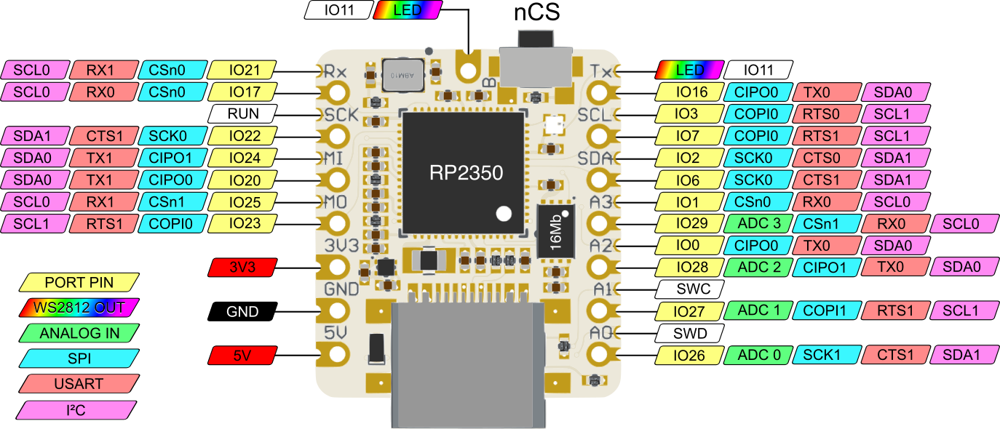
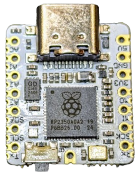
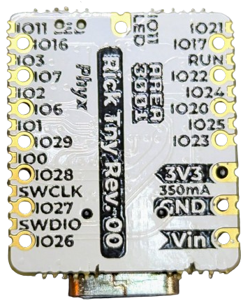
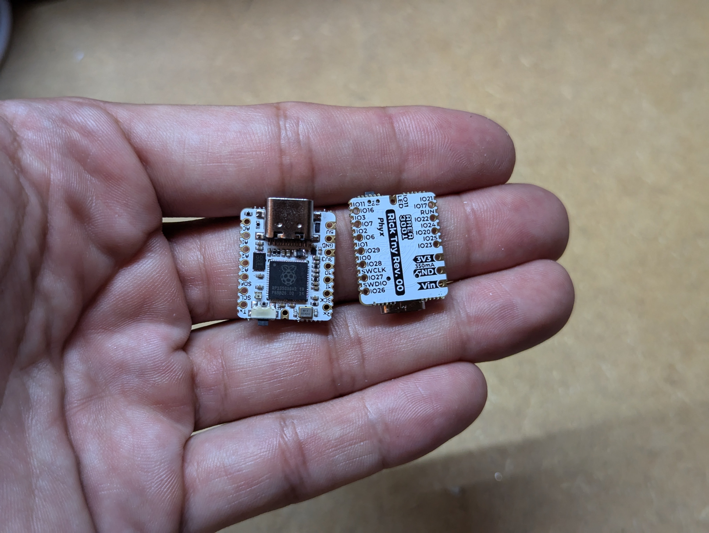

# RICK TNY
## RICK
RICK is a small development board based around the [Raspberry Pi RP2350A](https://www.raspberrypi.com/) microcontroller.

## Where can I get one?
Currently the only place to get your hands on the RICK_TNY is [in our Lectronz store](https://lectronz.com/products/rick-tny).

## TNY ?
TNY is our take on the [Adafruit QT Py](https://www.adafruit.com/category/595) and [Seeed studio XIAO](https://wiki.seeedstudio.com/Seeeduino-XIAO/) specifications but with added SMD pins for optional extra IO capabilities and a built in WS2811 compatible LED output.

## Pinout

## RICK REV 00
The first revision of this board uses a 4 layer PCB with filled vias.

